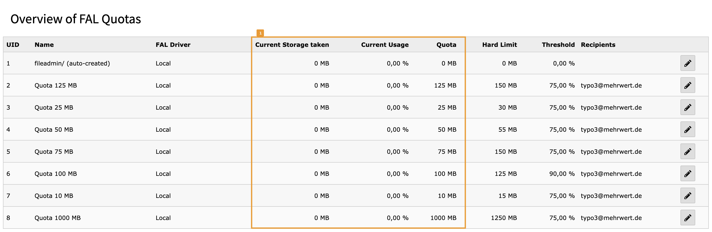
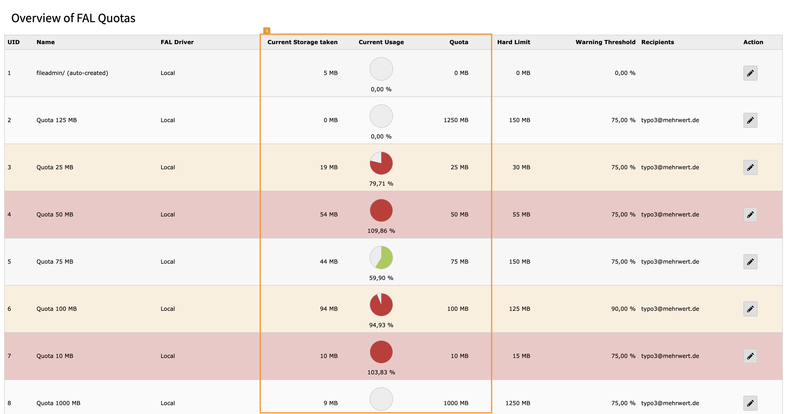
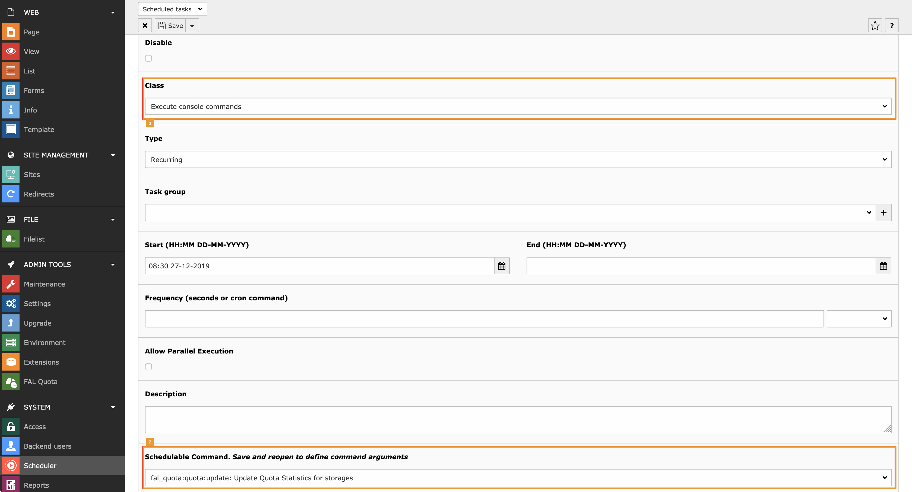
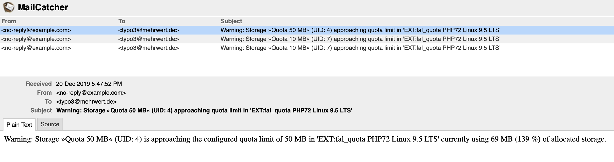

.. include:: ../Includes.txt

.. _administrator:

=============
Administrator
=============

The extensions provides a backend module to get an overview of the quotas for the storages as well as a Symfony command
that may be used as Scheduler task to update quota statistics also.

Overview of Storage with Quota
==============================

If quota limits have been configured for some of your storages, the backend module of FAL Quota shows those quota settings
in the list view but without the Scheduler task (or a manual update via CLI) without the current storage utilization [1]:

   Quota settings for storage in list view

As soon as you run the CLI task/Scheduler task the utilization will be updated and :guilabel:`Current Storage taken` [1]
will show the space in use. Storage record rows ar marked with a yellow background if the threshold is reached or with
a red background if the quota limit has been reached/exceeded.

   Quota settings for storage in list view with warnings

.. tip::

   Quotas may exceed their soft quota limit (100%) if files are added to the storage by S/FTP or directly in the file
   system. The scheduler task may then be used to regularly update quota statistics and send the email notifications.

Scheduler Task to update Quota Statistics
=========================================

To create a task for a recurring update of the quota statistics and to automatically send notification mails
go to :guilabel:`SYSTEM > Scheduler > Scheduled tasks` and click on the plus sign to add a task.
Choose :guilabel:`Execute console commands` from the Class list [1]. Click on the option list for
:guilabel:`Schedulable Command. Save and reopen to define command arguments` and select the
Symfony command :guilabel:`fal_quota:quota:update: Update Quota Statistics for storages` from the list [2].

   Quota settings for storage in list view with warnings

.. tip::

   Quota statistics of a storage is automatically updated with every action executed within the storage,
   the Scheduler task is mainly used to send notifications and sync external updates of the storage
   assets (e.g. files added by S/FTP). Set the execution interval according to your requirements.

Manually update Quota Statistics
================================

The task can also be manually executed on the command line using the TYPO3 CLI:

.. code-block:: bash

   ./public/typo3/sysext/core/bin/typo3 fal_quota:quota:update

You can optionally specify the UID of a storage to update a single storage record:

.. code-block:: bash

   ./public/typo3/sysext/core/bin/typo3 fal_quota:quota:update 1

Email Notifications
===================

The email notifications is currently very basic and just sends an informal mail about the storage reaching quota limits.

   Example quota warning mails
