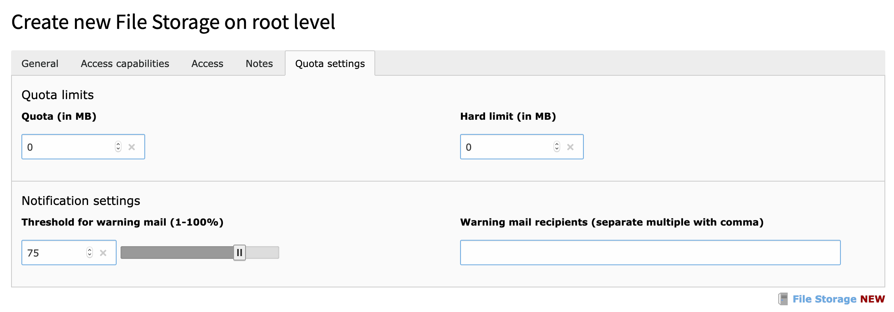
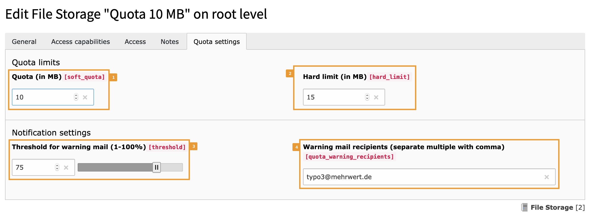

.. include:: ../Includes.txt

.. _configuration:

=============
Configuration
=============

The extension groups all quota related fields in a tab :guilabel:`Quota settings` in the File Storage records.
Quota configuration is done per storage.

   Example storage with »Quota Settings« tab active

Enabling Quota for a Storage
============================

To enable Quotas for a storage, you must set up a quota [1], a hard limit [2] and optionally a threshold (defaults to 75 %)
[3] and email recipient(s). Multiple recipient addresses are separated by comma (,) [4].

   Example quota configuration for storage with 10 MB quota, hard limit of 15 MB and a warning threshold of 75% (of the
   10 MB quota, sending notifications after reaching 7.5 MB).

The example above defines a soft quota of 10 MB [1] and a hard limit of 15 MB [2]. Hard limit values must be equal to or
greater than the soft quota values. The notification threshold value [3] defines the limit where the utilization check starts
sending email notifications (if recipients have been specified and the Scheduler task has been configured.
See :ref:`configuration` for details).
