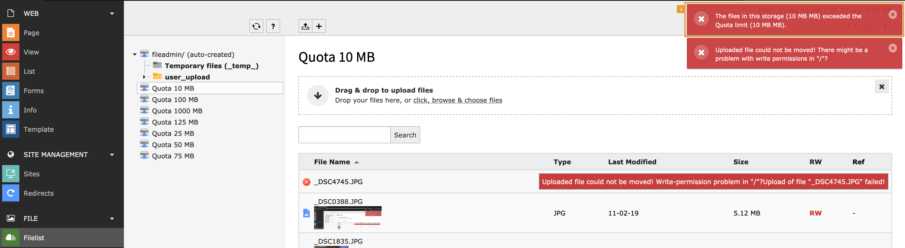

.. include:: ../Includes.txt

.. _editor:

======
Editor
======

If quotas have been enabled for a storage, they will immediately take effect on most of the actions in the storage.
Any upload, copy, create, cross-storage-move or replace action will be monitored and checked whether the result
will result in exceeding the quota limits. If this happens, editors get a verbose error message.

Backend Integration and Warnings
================================

Warnings are issued as flash messages and shown in the :guilabel:`FILE  > Filelist` module [1]:

   Quota warning in the File List Backend module

.. tip::

   Quota checks prevent any action like copy, move, create, replace or add, if the result will exceed quota limits.
   It is possible to delete files and folders though.
