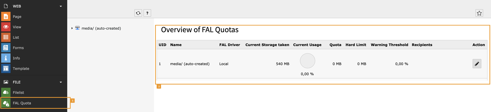

.. include:: ../Includes.txt

.. _installation:

============
Installation
============

The recommended way to install FAL Quota is by using `Composer <https://getcomposer.org>`__:

    `composer require mehrwert/fal-quota`

You also can install FAL Quota as extension from TYPO3 Extension Repository (TER). Just
`download <https://extensions.typo3.org/extension/fal_quota/>`__ and install the extension within
:guilabel:`ADMIN TOOLS > Extensions`.

Backend Module
==============

The extension adds some fields to the `sys_file_storage` database table to store quota configuration per storage. After
the extension has been successfully installed, access to a new backend module `FAL Quota` in the :guilabel:`FILE` section [1] may
be enabled for Backend Users and Groups via TYPO3 module configuration:

   Default backend module

The module provides an overview for all storages currently sorted by UID and their configured quota settings [2].

.. tip::

   The extension does not set any quota on installation. If you do not alter you storage configuration, nothing will
   change for your editors. You need to change the :ref:`configuration` for quota limits to enable checks.
